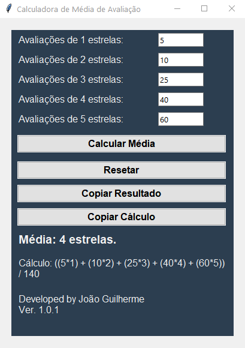

# Calculadora de Média de Avaliação

Versão: 1.0.1

Uma calculadora simples para calcular a média de avaliações com base na quantidade de estrelas.

## Descrição

Este programa permite que você insira a quantidade de avaliações para cada quantidade de estrelas, de 1 a 5, e calcula a média ponderada das avaliações. Cada quantidade de estrelas tem um peso diferente na média. A média calculada é exibida juntamente com a fórmula de cálculo.

## Recursos

- Interface gráfica simples construída com Tkinter.
- Validação de entrada para permitir apenas números inteiros positivos.
- Cálculo da média ponderada das avaliações.
- Exibição da fórmula de cálculo utilizada.
- Opção para copiar o resultado da média e a fórmula de cálculo para a área de transferência.

## Requisitos

- Python 3.x
- Bibliotecas Python: tkinter, pyperclip

## Como usar

1. Certifique-se de ter o Python instalado em seu sistema.
2. Instale as bibliotecas necessárias executando o seguinte comando:
pip install tkinter pyperclip
3. Faça o download ou clone este repositório.
4. Navegue até o diretório onde o arquivo `main.py` está localizado.
5. Execute o seguinte comando para iniciar o programa:
python main.py
6. Insira a quantidade de avaliações para cada quantidade de estrelas.
7. Clique no botão "Calcular Média" para calcular a média das avaliações.
8. O resultado da média e a fórmula de cálculo serão exibidos.
9. Você pode copiar o resultado ou a fórmula de cálculo clicando nos botões correspondentes.
10. Use o botão "Resetar" para limpar as entradas e os resultados.

## Exemplo

Suponha que você tenha as seguintes avaliações:

- 5 estrelas: 10 avaliações
- 4 estrelas: 15 avaliações
- 3 estrelas: 8 avaliações
- 2 estrelas: 2 avaliações
- 1 estrela: 1 avaliação

A média ponderada das avaliações será calculada como:
(10 * 5 + 15 * 4 + 8 * 3 + 2 * 2 + 1 * 1) / (10 + 15 + 8 + 2 + 1) = 3.85 estrelas

## Captura de tela

## Autor

Desenvolvido por [João Guilherme Buck Barcellos](https://github.com/joaobuckdev)

## Licença

Este projeto está licenciado sob a [Licença MIT](LICENSE).